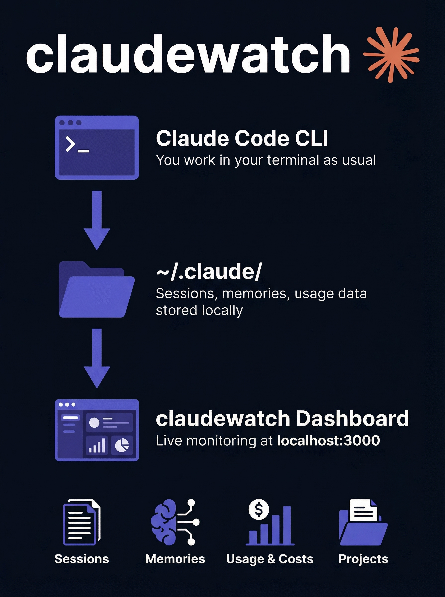
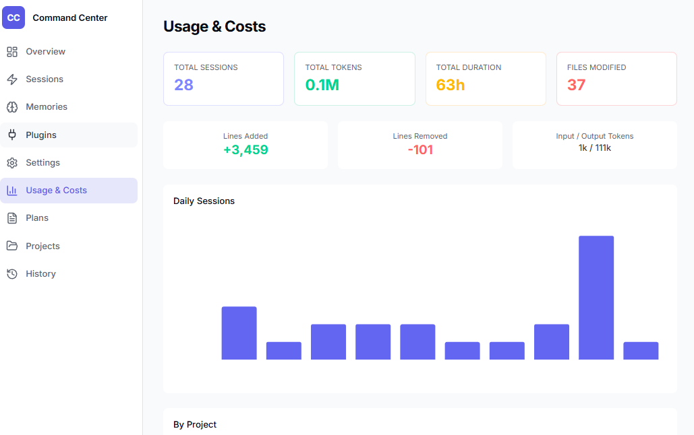

# claudewatch

> Local dashboard to monitor and manage your Claude Code sessions, usage, memories, plugins, and costs in real-time. No API keys needed — runs entirely on your machine.

<p align="center">
  
</p>



## Features

- **Live Overview** — Active sessions, total stats, recent activity feed, usage chart
- **Sessions** — Full history with goals, outcomes, satisfaction scores, friction details, token counts
- **Memories** — View, edit, and delete global + per-project memories with inline editor
- **Plugins & Skills** — Installed plugins with versions, enabled status, custom skills
- **Settings** — Model, CLI version, auto-updates, policies, CLAUDE.md preview
- **Usage & Costs** — Token usage, duration, lines changed, per-project breakdown with charts
- **Plans** — Browse implementation plans with markdown preview
- **Projects** — All projects with session counts, activity status, drill-down detail
- **History** — Searchable, paginated prompt history across all projects
- **Dark / Light Mode** — Toggle between deep navy dark theme and clean light theme
- **Collapsible Sidebar** — Icon-only or expanded with labels, persists your preference

## Tech Stack

- **Next.js 16** (App Router, React 19, Turbopack)
- **shadcn/ui + Tailwind CSS v4**
- **TanStack React Query** (live polling every 5s)
- **Recharts** (usage charts, project breakdown)
- **next-themes** (dark/light mode)
- **Zero database** — reads directly from `~/.claude/`

## Quick Start

```bash
git clone git@github.com:NBenzekri/claudewatch.git
cd claudewatch
npm install
npm run dev
```

Open [http://localhost:3000](http://localhost:3000)

## Configuration

All configuration is optional. The app auto-detects your `~/.claude/` directory.

| Variable | Default | Description |
|----------|---------|-------------|
| `CLAUDE_HOME` | `~/.claude` | Override path to Claude config directory |
| `PORT` | `3000` | Dashboard port |
| `NEXT_PUBLIC_REFRESH_INTERVAL` | `5000` | Polling interval in ms |

## Requirements

- **Node.js 18+**
- **Claude Code CLI** installed (the app reads its local data files)

## How It Works

claudewatch reads files from your local `~/.claude/` directory:

| Data | Source |
|------|--------|
| Active sessions | `~/.claude/sessions/*.json` |
| Session history | `~/.claude/usage-data/facets/*.json` + `session-meta/*.json` |
| Memories | `~/.claude/memory/*.md` + `projects/*/memory/` |
| Plugins | `~/.claude/plugins/installed_plugins.json` |
| Settings | `~/.claude/settings.json` + `policy-limits.json` |
| Usage stats | `~/.claude/usage-data/session-meta/*.json` |
| Plans | `~/.claude/plans/*.md` |
| Projects | `~/.claude/projects/` |
| Prompt history | `~/.claude/history.jsonl` |

**No API keys needed. No data leaves your machine. No database required.**

## Cross-Platform

Works on Windows, macOS, and Linux. Path resolution uses `os.homedir()` automatically.

## Contributing

PRs welcome! This project was built to help Claude Code users monitor their activity. If you have ideas for new features or improvements, open an issue or submit a PR.

## License

MIT
